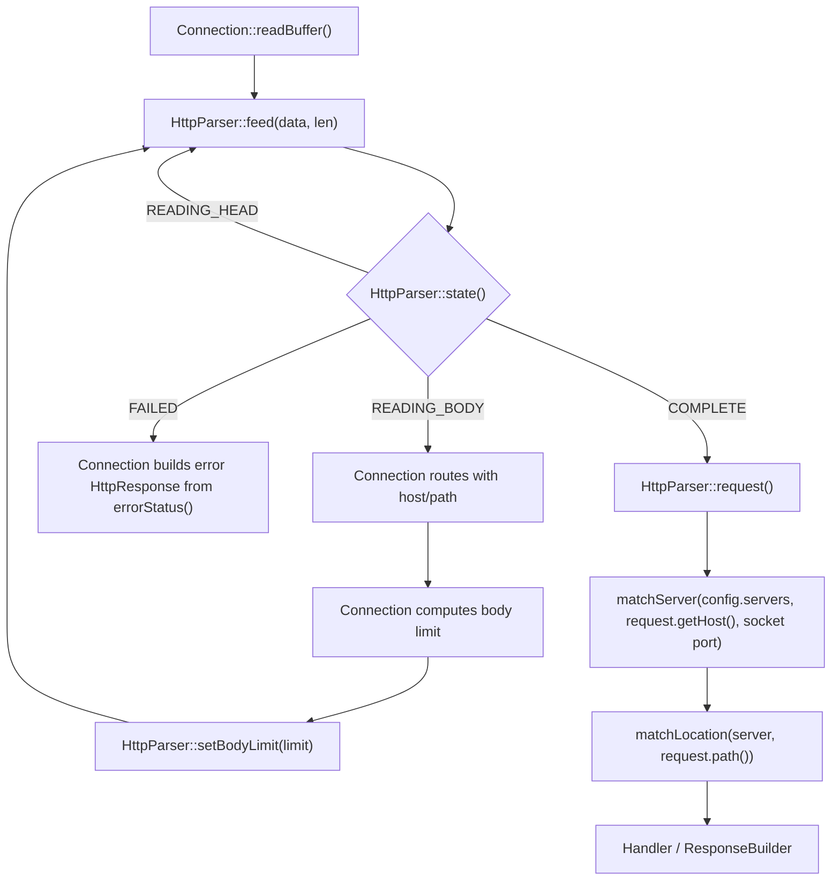
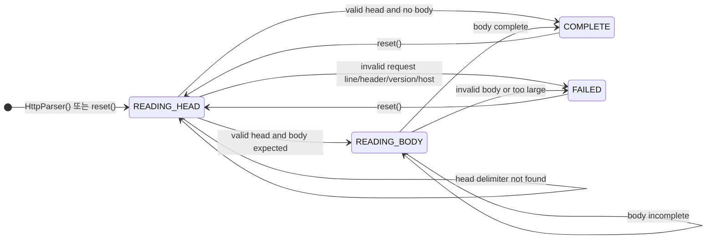
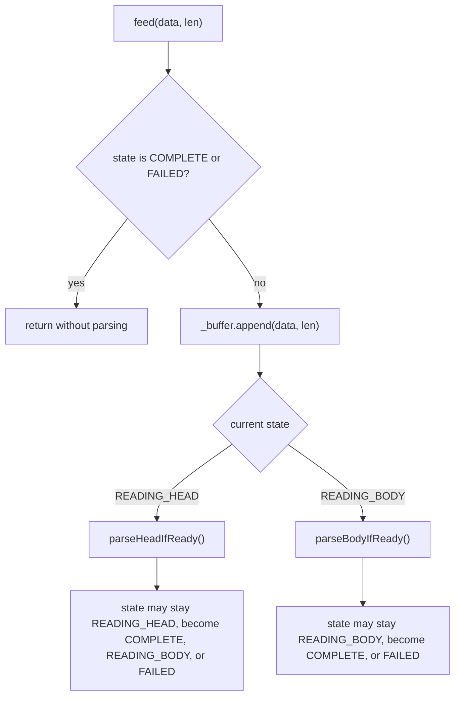
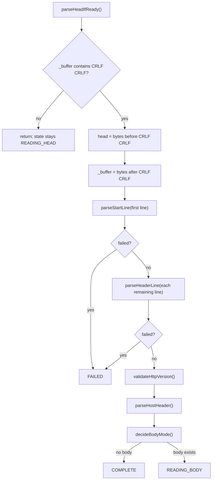
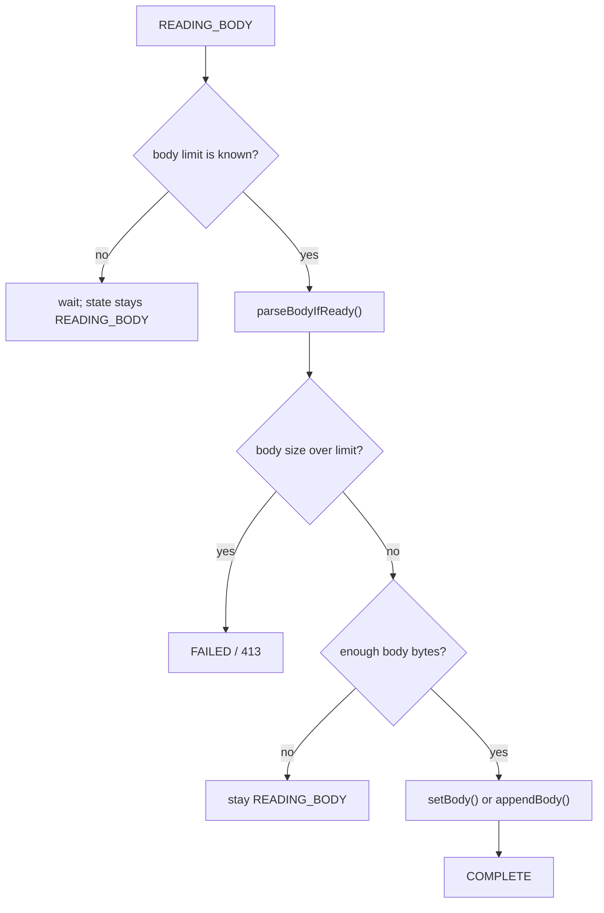
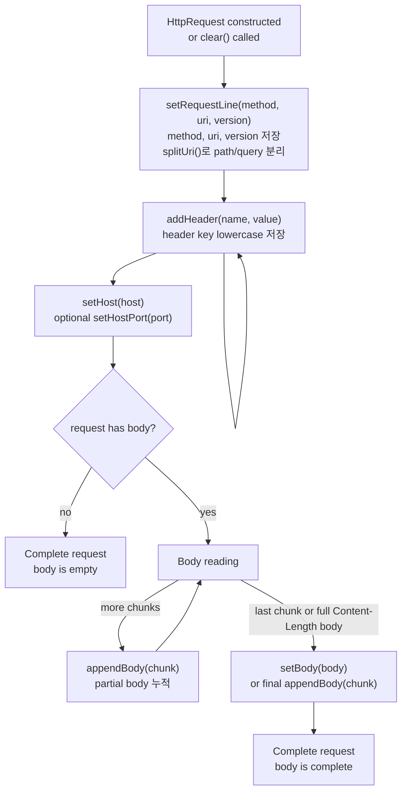
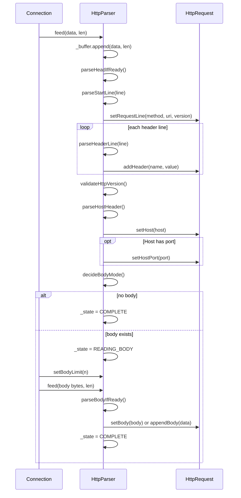

# HTTP Request / Parser / Router Design

이 문서는 Owner A의 책임 범위인 `HttpRequest`, `HttpParser`, `HttpMethod`, `matchServer`, `matchLocation`의 기준 설계를 고정한다.

앞으로 이 범위에서는 다음 결정을 따른다.

- `friend`는 사용하지 않는다.
- `HttpMethod`는 class가 아니라 C++98 `enum`으로 정의한다.
- `HttpMethod` 관련 변환은 클래스 메서드가 아니라 free function으로 둔다.
- `HttpRequest`는 읽기 API와 Parser가 채우는 명시적 setter를 가진 class로 둔다.
- 요청 파싱 상태는 `HttpRequest`가 아니라 `HttpParser`가 가진다.

## 1. 책임 경계

| 대상 | 책임 |
| --- | --- |
| `HttpMethod` | HTTP method 값을 표현한다. |
| `parseHttpMethod` | 문자열 method를 `HttpMethod` enum으로 변환한다. |
| `HttpRequest` | 파싱 완료된 요청 데이터를 보관한다. |
| `HttpParser` | TCP에서 들어온 부분 입력을 누적하고 `HttpRequest`를 완성한다. |
| `matchServer` | host, port 기준으로 `ServerConfig`를 고른다. |
| `matchLocation` | request path 기준으로 가장 긴 prefix location을 고른다. |

`HttpRequest`는 상태 머신이 아니다. `HttpRequest`는 Parser가 만든 결과물이다.

상태 전이는 `HttpParser::State`가 관리한다.

## 2. 전체 흐름



`READING_BODY` 상태로 전환된 직후에는 Parser가 body를 처리하기 전에 멈춘다. Connection은 이 시점에 `Host`와 `path`를 기준으로 routing을 수행하고, matched server/location 기준 body limit을 계산한 뒤 `setBodyLimit()`을 호출한다.

## 3. HttpParser / HttpRequest 상태도

`HttpParser`는 실제 상태 머신이다. `HttpRequest` 객체 자체는 외부에 상태 enum을 노출하지 않고, Parser가 만든 결과를 저장하는 모델로만 동작한다.

### HttpParser 상태 머신

상태도는 `HttpParser::State` 값이 언제 바뀌는지만 보여준다. `feed()`는 상태 자체가 아니라 입력을 누적하고 현재 상태에 맞는 내부 파서를 호출하는 진입점이다.



### `feed()` 진입 흐름

`feed()`는 모든 raw bytes가 들어오는 단일 입구다. 입력을 `_buffer`에 붙인 뒤, 현재 상태에 따라 head parser 또는 body parser를 호출한다.



### 상태별 내부 처리

| 상태 | 호출되는 주요 메서드 | 결과 |
| --- | --- | --- |
| `READING_HEAD` | `parseHeadIfReady()` | `\r\n\r\n`이 없으면 상태를 유지한다. |
| `READING_HEAD` | `parseStartLine()`, `parseHeaderLine()`, `validateHttpVersion()`, `parseHostHeader()` | head가 유효하면 `decideBodyMode()`로 넘어간다. 중간에 오류가 있으면 `FAILED`가 된다. |
| `READING_HEAD` | `decideBodyMode()` | body가 없으면 `COMPLETE`, body가 있으면 `READING_BODY`가 된다. |
| `READING_BODY` | `setBodyLimit()`, `parseBodyIfReady()` | body가 부족하면 상태를 유지하고, 완료되면 `COMPLETE`이 된다. |
| `READING_HEAD` / `READING_BODY` | `fail(status)` | 오류가 있으면 `FAILED`가 되고 `_errorStatus`에 HTTP status를 저장한다. |
| `COMPLETE` / `FAILED` | `reset()` | Parser와 내부 `HttpRequest`를 초기화하고 `READING_HEAD`로 돌아간다. |

### Head parsing 흐름



### Body parsing 흐름

`READING_BODY`에서는 head parsing이 끝난 상태다. Parser는 Connection이 `setBodyLimit(n)`을 호출하기 전에는 body를 확정 처리하지 않는다.



### HttpRequest 생성 흐름

아래 흐름도는 `HttpRequest`의 실제 enum 상태가 아니라, `HttpParser`가 `HttpRequest`의 setter를 호출해 데이터를 채워가는 순서다. 요청 검증 실패는 `HttpParser::FAILED`로 처리되며 `HttpRequest` 자체의 상태가 아니다.



### Parser와 Request 메서드 호출 흐름



## 4. 필요한 파일

추천 파일 구성은 다음과 같다.

```text
includes/HTTP/
  HttpMethod.hpp
  HttpRequest.hpp
  HttpParser.hpp
  HttpHelper.hpp
  HttpSyntax.hpp
  Router.hpp

srcs/HTTP/
  HttpMethod.cpp
  HttpRequest.cpp
  HttpParser.cpp
  HttpHelper.cpp
  HttpSyntax.cpp
  Router.cpp
```

`HttpHelper`는 lowercase 변환, trim처럼 범용 문자열 helper만 둔다.

`HttpSyntax`는 Owner A 내부의 HTTP request 문법 helper다. header field 문법, request-target 검증, percent-decoding, dot-segment 정규화, chunk size hex 파싱처럼 Parser/Request 모델 구현에 필요한 HTTP syntax 처리를 담당하며, 다른 owner가 직접 의존해야 하는 공용 프로젝트 API로 보지 않는다.

## 5. HttpMethod

### 파일

- `includes/HTTP/HttpMethod.hpp`
- `srcs/HTTP/HttpMethod.cpp`

### 인터페이스

```cpp
#ifndef WEBSERV_HTTP_METHOD_HPP
#define WEBSERV_HTTP_METHOD_HPP

#include <string>

enum HttpMethod {
    HTTP_GET,
    HTTP_POST,
    HTTP_DELETE,
    HTTP_UNKNOWN
};

HttpMethod parseHttpMethod(const std::string& method);
const char* httpMethodToString(HttpMethod method);
bool isSupportedHttpMethod(HttpMethod method);

#endif
```

### 담당 로직

| 함수 | 담당 |
| --- | --- |
| `parseHttpMethod` | `"GET"`, `"POST"`, `"DELETE"`를 enum으로 변환한다. |
| `httpMethodToString` | enum을 응답/로그용 문자열로 변환한다. |
| `isSupportedHttpMethod` | Webserv subject에서 허용하는 method인지 판단한다. |

`HttpMethod`를 class로 만들지 않는다. HTTP method는 동작을 가진 객체가 아니라 제한된 값 목록이므로 C++98에서는 `enum + free function`이 가장 단순하다.

## 6. HttpRequest

### 파일

- `includes/HTTP/HttpRequest.hpp`
- `srcs/HTTP/HttpRequest.cpp`

### 인터페이스

```cpp
#ifndef WEBSERV_HTTP_REQUEST_HPP
#define WEBSERV_HTTP_REQUEST_HPP

#include <map>
#include <string>
#include "HttpMethod.hpp"

class HttpRequest {
public:
    HttpRequest();

    HttpMethod method() const;
    const std::string& methodString() const;
    const std::string& uri() const;
    const std::string& path() const;
    const std::string& query() const;
    const std::string& version() const;
    const std::string& getHost() const;
    int getHostPort() const;
    bool hasHostPort() const;

    bool hasHeader(const std::string& name) const;
    const std::string& header(const std::string& name) const;
    const std::map<std::string, std::string>& headers() const;

    const std::string& body() const;

    bool setRequestLine(const std::string& method,
                        const std::string& uri,
                        const std::string& version);
    void addHeader(const std::string& name,
                   const std::string& value);
    void setHost(const std::string& host);
    void setHostPort(int port);
    void setBody(const std::string& body);
    void appendBody(const std::string& data);
    void clear();

private:
    bool splitUri();

private:
    HttpMethod _method;
    std::string _methodString;
    std::string _uri;
    std::string _path;
    std::string _query;
    std::string _version;
    std::string _host;
    int _hostPort;
    bool _hasHostPort;
    std::map<std::string, std::string> _headers;
    std::string _body;
};

#endif
```

### 담당 로직

| 메서드 | 담당 |
| --- | --- |
| `HttpRequest()` | `_method`를 `HTTP_UNKNOWN`으로 초기화한다. |
| `method()` | 파싱된 enum method를 반환한다. |
| `methodString()` | 원본 method 문자열을 반환한다. 예: `"GET"`, `"PATCH"`. |
| `uri()` | request line의 원본 URI를 반환한다. 예: `"/upload?a=1"`. |
| `path()` | query를 제거한 path를 반환한다. 예: `"/upload"`. |
| `query()` | `?` 뒤 query string을 반환한다. 없으면 빈 문자열이다. |
| `version()` | HTTP version 문자열을 반환한다. 예: `"HTTP/1.1"`. |
| `getHost()` | `Host` 헤더에서 분리한 hostname을 반환한다. 예: `"localhost"`. |
| `getHostPort()` | `Host` 헤더에 명시된 port를 `int`로 반환한다. port가 없으면 `0`을 반환한다. |
| `hasHostPort()` | `Host` 헤더에 port가 명시됐는지 반환한다. |
| `hasHeader(name)` | lowercase 기준으로 헤더 존재 여부를 반환한다. |
| `header(name)` | lowercase 기준으로 헤더 값을 반환한다. 없으면 빈 문자열 참조를 반환한다. |
| `headers()` | 전체 헤더 map을 반환한다. |
| `body()` | 완성된 body를 반환한다. chunked 요청이면 디코딩된 body를 반환한다. |
| `setRequestLine()` | method, uri, version을 저장하고 `splitUri()`를 호출한다. URI 검증 또는 정규화에 실패하면 `false`를 반환한다. |
| `addHeader()` | header name을 lowercase로 정규화해서 저장한다. |
| `setHost()` | Parser가 `Host` 헤더에서 분리한 hostname을 저장한다. |
| `setHostPort()` | Parser가 `Host` 헤더에서 분리한 port를 저장하고 `_hasHostPort`를 true로 둔다. |
| `setBody()` | body 전체를 교체한다. |
| `appendBody()` | body 조각을 뒤에 붙인다. |
| `clear()` | 객체를 초기 상태로 되돌린다. |
| `splitUri()` | `uri_`를 `path_`와 `query_`로 분리하고, path percent-decoding과 dot-segment 정규화를 수행한다. |

### 불변 조건

- `_headers`의 key는 항상 lowercase다.
- `_path`에는 query string이 들어가지 않고, percent-decoded 및 dot-segment 정규화된 absolute path만 들어간다.
- `_query`에는 `?` 문자가 들어가지 않는다.
- `_method == HTTP_UNKNOWN`이어도 `_methodString`에는 원본 문자열을 보존한다.
- `_host`에는 `Host` 헤더의 hostname만 저장한다. `host:port`의 `:port`는 들어가지 않는다.
- `_hostPort`는 `_hasHostPort == true`일 때만 의미가 있다.
- 외부 모듈은 `HttpRequest` 필드에 직접 접근하지 않는다.

## 7. HttpParser

### 파일

- `includes/HTTP/HttpParser.hpp`
- `srcs/HTTP/HttpParser.cpp`

### 인터페이스

```cpp
#ifndef WEBSERV_HTTP_PARSER_HPP
#define WEBSERV_HTTP_PARSER_HPP

#include <cstddef>
#include <string>
#include "HttpRequest.hpp"

class HttpParser {
public:
    enum State { READING_HEAD, READING_BODY, COMPLETE, FAILED };

    HttpParser();

    void feed(const char* data, std::size_t len);
    void setBodyLimit(std::size_t n);
    State state() const;
    int errorStatus() const;
    const HttpRequest& request() const;
    const std::string& bufferedBytes() const;
    void reset();
    void resetPreservingBuffer();

private:
    void resetState(bool clearBuffer);
    void parseHeadIfReady();
    void parseStartLine(const std::string& line);
    void parseHeaderLine(const std::string& line);
    void parseHostHeader();
    void validateHttpVersion();
    void decideBodyMode();
    void parseBodyIfReady();
    void fail(int status);

private:
    State _state;
    int _errorStatus;
    std::string _buffer;
    HttpRequest _request;
    std::size_t _contentLength;
    std::size_t _bodyLimit;
    std::size_t _headerCount;
    bool _chunked;
    bool _hasBodyLimit;
};

#endif
```

### 담당 로직

| 메서드 | 담당 |
| --- | --- |
| `HttpParser()` | `READING_HEAD`, `_errorStatus = 0`으로 초기화한다. |
| `feed(data, len)` | 입력을 `_buffer`에 누적하고 현재 상태에 맞는 파싱을 진행한다. |
| `setBodyLimit(n)` | Connection이 server/location 매칭 후 계산한 body size limit을 Parser에 주입한다. |
| `state()` | 현재 Parser 상태를 반환한다. |
| `errorStatus()` | `FAILED`일 때 HTTP status code를 반환한다. |
| `request()` | `COMPLETE`일 때 완성된 `HttpRequest`를 반환한다. |
| `bufferedBytes()` | `COMPLETE` 이후 아직 소비하지 않은 bytes를 반환한다. keep-alive에서 같은 read에 다음 요청 일부가 붙은 경우 Connection이 확인할 수 있다. |
| `reset()` | Parser와 내부 `HttpRequest`를 재사용 가능한 초기 상태로 되돌린다. |
| `resetPreservingBuffer()` | `_buffer`를 유지한 채 Parser와 내부 `HttpRequest`를 초기화하고, 이미 들어온 다음 요청을 다시 파싱한다. |
| `parseHeadIfReady()` | `\r\n\r\n`이 들어왔는지 확인하고 start line/header를 파싱한다. |
| `parseStartLine()` | method, URI, version을 분리하고 `HttpRequest::setRequestLine()`을 호출한다. |
| `parseHeaderLine()` | `name: value` 형식인지 확인하고 `HttpRequest::addHeader()`를 호출한다. |
| `parseHostHeader()` | `Host` 헤더를 `host`와 optional `port`로 split해서 `HttpRequest`에 저장한다. |
| `validateHttpVersion()` | version 형식 오류와 지원하지 않는 version을 분리해서 status를 결정한다. |
| `decideBodyMode()` | `Content-Length`, `Transfer-Encoding` 기준으로 body 처리 방식을 결정한다. 두 헤더가 같이 있으면 `400`으로 실패한다. |
| `parseBodyIfReady()` | body가 충분히 도착했는지 확인하고 `setBody()` 또는 `appendBody()`를 호출한다. 누적량이 limit을 넘으면 `413`으로 실패한다. |
| `fail(status)` | `_state = FAILED`, `_errorStatus = status`로 설정한다. |

### Parser 상태 의미

| 상태 | 의미 |
| --- | --- |
| `READING_HEAD` | request line과 headers가 아직 완성되지 않았다. |
| `READING_BODY` | head는 파싱됐고 body를 기다리는 중이다. 이 상태에 들어오면 Connection이 routing 후 `setBodyLimit()`을 호출해야 한다. |
| `COMPLETE` | `HttpRequest`가 완성됐다. |
| `FAILED` | 잘못된 요청이며 `errorStatus()`로 응답 status를 확인한다. |

### 최소 M1 구현 범위

M1 목표는 정적 GET 연결이다. 따라서 처음 PR에서는 아래까지만 완성해도 된다.

- 부분 입력 누적
- request line 파싱
- header 파싱
- header key lowercase 저장
- `GET /path HTTP/1.1`
- `Host` 헤더 저장
- body 없는 요청은 `COMPLETE`
- 잘못된 request line은 `FAILED` + `400`
- 지원하지 않는 method는 `FAILED` + `501`

### M2 확장 범위

현재 구현은 아래 항목까지 포함한다.

- `Content-Length` body 처리
- `Transfer-Encoding: chunked` 디코딩
- `setBodyLimit()` 기반 body size 제한 처리
- header section, field line, header count 제한
- request-target 길이 제한
- URI 형식 검증, path percent-decoding, dot-segment 정규화
- 중복/충돌 헤더 정책
- 같은 read에 다음 요청 bytes가 붙은 경우 `_buffer`에 보존하고 `resetPreservingBuffer()`로 다음 요청을 시작하는 API

## 8. Router

### 파일

- `includes/HTTP/Router.hpp`
- `srcs/HTTP/Router.cpp`

### 인터페이스

```cpp
#ifndef WEBSERV_ROUTER_HPP
#define WEBSERV_ROUTER_HPP

#include <string>
#include <vector>
#include "Config.hpp"

const ServerConfig* matchServer(const std::vector<ServerConfig>& servers,
                                const std::string& host,
                                int port);

const LocationConfig* matchLocation(const ServerConfig& server,
                                    const std::string& path);

#endif
```

### 담당 로직

| 함수 | 담당 |
| --- | --- |
| `matchServer()` | 같은 port의 server 중 host가 `serverNames`와 일치하는 server를 반환한다. |
| `matchLocation()` | `path`와 가장 길게 segment-boundary prefix match되는 location을 반환한다. |

### `matchServer` 규칙

1. `port`가 일치하는 server만 후보로 본다.
2. `host`가 `serverNames` 중 하나와 같으면 해당 server를 반환한다.
3. 같은 port에 host 일치가 없으면 같은 port의 첫 번째 server를 default server로 반환한다.
4. 같은 port의 server가 없으면 `NULL`을 반환한다.

`Host` 헤더에 port가 붙어 있는 경우, 예를 들어 `localhost:8080`, Parser가 `localhost`와 `8080`으로 split해서 `HttpRequest`에 저장한다. Router는 `request.getHost()`의 hostname만 server name matching에 사용하고, routing 대상 port는 listening socket에서 결정된 port를 사용한다.

`Host` 헤더가 없는 경우는 version에 따라 다르게 처리한다.

- `HTTP/1.1`: Parser가 `400`으로 실패한다.
- `HTTP/1.0`: HTTP/1.0을 허용하는 정책이면 해당 port의 default server로 라우팅한다. 현재 version 정책은 `HTTP/1.0`을 `505`로 거부하므로, 실제 구현에서는 `505`가 먼저 적용된다.

### `matchLocation` 규칙

1. 모든 location의 `path`를 후보로 본다.
2. location path가 `/`이면 fallback location으로 본다. `/`는 `/`로 시작하는 모든 request path와 match된다.
3. `/`가 아닌 location은 request path가 location path로 시작하고, prefix가 끝나는 위치의 다음 문자가 `/`이거나 문자열 끝이면 match로 본다.
4. 여러 개가 match되면 가장 긴 location path를 고른다. 따라서 더 구체적인 location이 있으면 `/` fallback보다 우선한다.
5. 하나도 match되지 않으면 `NULL`을 반환한다. `/` location이 설정되어 있으면 정상적인 absolute request path는 fallback으로라도 match된다.

nginx의 순수 prefix matching과 달리 path segment boundary를 확인한다.

```text
/            matches /
/            matches /upload/file.txt
/upload      matches /upload
/upload      matches /upload/file.txt
/upload      does not match /upload2
```

## 9. 담당 매핑

| 입력/처리 단계 | 담당 클래스/함수 | 호출되는 HttpRequest 메서드 |
| --- | --- | --- |
| raw socket bytes 수신 | `Connection` | 없음 |
| parser에 바이트 전달 | `HttpParser::feed()` | 없음 |
| request line 분리 | `HttpParser::parseStartLine()` | `setRequestLine()` |
| method 문자열 변환 | `parseHttpMethod()` | 없음 |
| URI path/query 분리 | `HttpRequest::splitUri()` | 내부 private |
| header line 분리 | `HttpParser::parseHeaderLine()` | `addHeader()` |
| header key lowercase | `HttpRequest::addHeader()` | 내부 처리 |
| `Host` 헤더 host/port 분리 | `HttpParser::parseHostHeader()` | `setHost()`, `setHostPort()` |
| body 모드 판단 | `HttpParser::decideBodyMode()` | `hasHeader()`, `header()` |
| routing 및 body limit 계산 | `Connection` | `getHost()`, `path()` |
| body limit 주입 | `Connection` | `HttpParser::setBodyLimit()` |
| body 저장 | `HttpParser::parseBodyIfReady()` | `setBody()`, `appendBody()` |
| 완성 요청 조회 | `HttpParser::request()` | getter들 |
| server 선택 | `matchServer()` | `getHost()` |
| location 선택 | `matchLocation()` | `path()` |

## 10. 에러 처리 기준

Owner A 범위에서는 요청 처리 중 예외를 던지지 않는다.

Parser 에러는 다음 방식으로 표현한다.

```cpp
_state = FAILED;
_errorStatus = 400;
```

추천 status 기준:

| 상황 | status |
| --- | --- |
| request line 형식 오류 | `400` |
| request-target 형식 오류, fragment 포함, invalid percent-encoding, root 밖으로 나가는 dot-segment | `400` |
| request-target 길이 초과 | `414` |
| header line 형식 오류 | `400` |
| header section, header line, header count 제한 초과 | `431` |
| `HTTP/1.0` | `505` |
| version 형식 오류 (`HTP/1.1`, `HTTP/1`, `HTTP/1.x` 등) | `400` |
| `HTTP/1.1` 요청에 `Host` 헤더 없음 | `400` |
| `Host` 헤더가 여러 개이거나 invalid value | `400` |
| `Content-Length` 중복 값이 서로 다름 | `400` |
| 지원하지 않는 method | `501` |
| body가 제한보다 큼 | `413` |
| `Transfer-Encoding`과 `Content-Length`가 동시에 존재 | `400` |
| chunked body 형식 오류 | `400` |

`Transfer-Encoding`과 `Content-Length`가 동시에 존재하는 요청은 `400` 응답 후 connection을 닫는다.

body size limit은 Parser가 판단하되, limit 값은 Parser 외부에서 주입한다.

1. Parser가 request line과 headers까지 읽고 `READING_BODY`로 전환한다.
2. Connection이 `matchServer()`와 `matchLocation()`을 수행한다.
3. Connection이 location의 `clientMaxBodySize`를 확인한다. location 값이 `0`이면 server 값을 사용한다.
4. Connection이 `HttpParser::setBodyLimit(n)`을 호출한다.
5. Parser가 body를 읽으면서 누적량이 limit을 넘으면 `413`으로 실패한다.

`Content-Length`가 limit보다 크면 body를 다 읽기 전에 즉시 `413`으로 실패할 수 있다. `Transfer-Encoding: chunked`는 디코딩된 body 누적 크기를 기준으로 초과 여부를 확인한다.

## 11. 구현 순서

Owner A는 다음 순서로 작업한다.

1. `HttpMethod.hpp/cpp`
2. `HttpRequest.hpp/cpp`
3. `Router.hpp/cpp`
4. `HttpParser.hpp/cpp` skeleton
5. M1용 GET/head parser
6. `Content-Length` body 처리
7. chunked body 처리
8. 에러 케이스 보강

이 순서의 이유는 `HttpRequest`가 Parser와 Router의 공통 입력/출력 지점이고, `HttpMethod`는 `HttpRequest`가 의존하는 가장 작은 타입이기 때문이다.

## 12. 미팅 합의 사항

아래 항목은 팀 미팅에서 확정한 정책이다.

| 항목 | 합의 |
| --- | --- |
| `location /upload`와 `/upload2` | match하지 않는다. prefix 다음 문자가 `/` 또는 string end일 때만 match한다. |
| `Host` 헤더 없음, `HTTP/1.1` | `400` |
| `Host` 헤더 없음, `HTTP/1.0` | HTTP/1.0을 허용하는 경우 해당 port의 default server로 라우팅한다. 현재 version 정책에서는 `HTTP/1.0` 자체가 `505`다. |
| `Host: host:port` 처리 | Parser가 split하고 `HttpRequest`에 hostname과 port를 분리 저장한다. |
| Router의 port 기준 | `Host` 헤더의 port가 아니라 listening socket에서 결정된 port를 사용한다. |
| `HTTP/1.0` | `505` |
| version 형식 오류 | `400` |
| body size 제한 | Parser가 판단한다. 단, limit 값은 Connection이 routing 후 `setBodyLimit()`으로 주입한다. |
| `Transfer-Encoding` + `Content-Length` 동시 존재 | `400` 응답 후 connection close |
| request-target 지원 형식 | origin-form만 허용한다. path는 percent-decoding 후 dot-segment 정규화하고, `/..`로 root 밖을 가리키면 `400`이다. |
| Parser 제한값 | header section 16KB, field line 4KB, header 100개, request-target 2KB, chunk-size line 1KB |
| 같은 read의 다음 요청 bytes | `COMPLETE` 이후 `_buffer`에 남기고, response write 완료 후 `resetPreservingBuffer()`로 다음 요청 파싱을 시작한다. |
| `HttpParser::State` 완료 상태명 | `COMPLETE`을 유지한다. |
| Parser 에러 조회 API | `errorStatus()`를 유지한다. |
| body limit 주입 흐름 | `READING_BODY` 상태에서 Connection이 routing 후 `setBodyLimit(n)`을 호출하는 현행 흐름을 유지한다. |
| Config 최소 필드명 | `port`, `serverNames`, `locations.path`를 유지한다. |
| method 지원 여부 함수명 | `isSupportedHttpMethod()`를 유지한다. |
| Handler/CGI 입력 body | Parser가 chunked request를 unchunk하고, Handler/CGI는 항상 unchunked body를 받는 계약을 유지한다. |

이 합의를 기준으로 Owner A의 `HttpRequest`, `HttpParser`, Router helper 구현을 진행한다.
