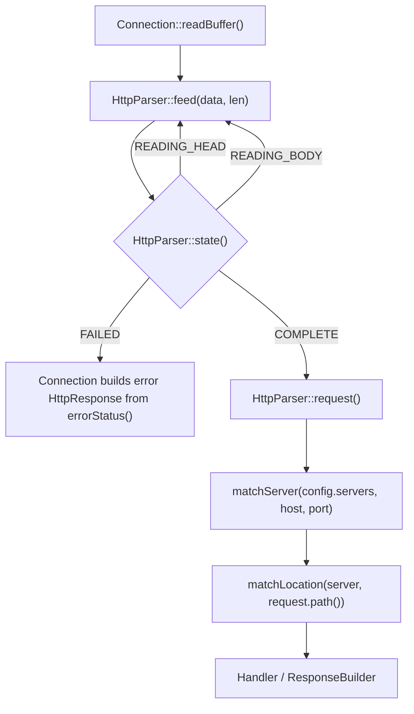
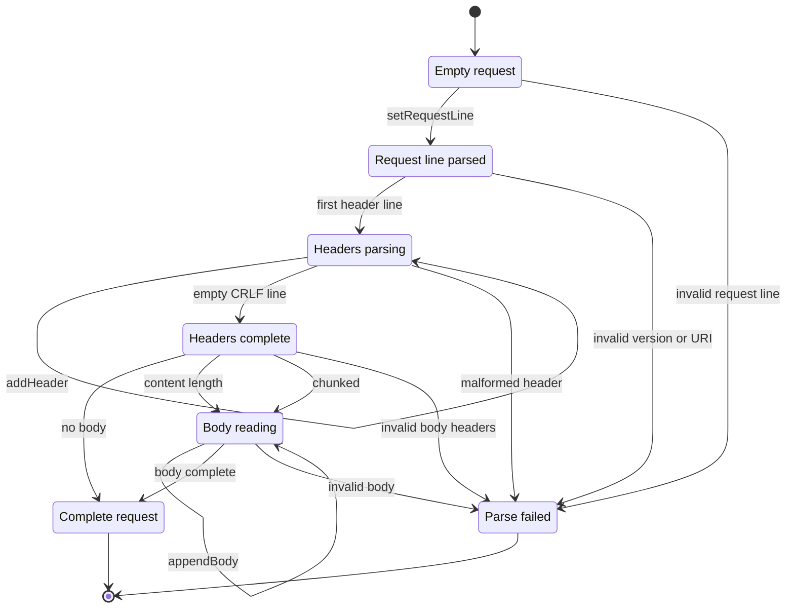

# HTTP Request / Parser / Router Design

이 문서는 Owner A의 책임 범위인 `HttpRequest`, `HttpParser`, `HttpMethod`, `matchServer`, `matchLocation`의 기준 설계를 고정한다.

앞으로 이 범위에서는 다음 결정을 따른다.

- `friend`는 사용하지 않는다.
- `HttpMethod`는 class가 아니라 C++98 `enum`으로 정의한다.
- `HttpMethod` 관련 변환은 클래스 메서드가 아니라 free function으로 둔다.
- `HttpRequest`는 읽기 API와 Parser가 채우는 명시적 setter를 가진 class로 둔다.
- 요청 파싱 상태는 `HttpRequest`가 아니라 `HttpParser`가 가진다.

## 1. 책임 경계

| 대상 | 책임 |
| --- | --- |
| `HttpMethod` | HTTP method 값을 표현한다. |
| `parseHttpMethod` | 문자열 method를 `HttpMethod` enum으로 변환한다. |
| `HttpRequest` | 파싱 완료된 요청 데이터를 보관한다. |
| `HttpParser` | TCP에서 들어온 부분 입력을 누적하고 `HttpRequest`를 완성한다. |
| `matchServer` | host, port 기준으로 `ServerConfig`를 고른다. |
| `matchLocation` | request path 기준으로 가장 긴 prefix location을 고른다. |

`HttpRequest`는 상태 머신이 아니다. `HttpRequest`는 Parser가 만든 결과물이다.

상태 전이는 `HttpParser::State`가 관리한다.

## 2. 전체 흐름



## 3. HttpRequest 생성 상태도

`HttpRequest` 객체 자체는 외부에 상태 enum을 노출하지 않는다. 아래 상태도는 `HttpParser`가 `HttpRequest`를 채워가는 내부 흐름이다.



## 4. 필요한 파일

추천 파일 구성은 다음과 같다.

```text
include/
  HttpMethod.hpp
  HttpRequest.hpp
  HttpParser.hpp
  Router.hpp

src/
  HttpMethod.cpp
  HttpRequest.cpp
  HttpParser.cpp
  Router.cpp
```

## 5. HttpMethod

### 파일

- `include/HttpMethod.hpp`
- `src/HttpMethod.cpp`

### 인터페이스

```cpp
#ifndef WEBSERV_HTTP_METHOD_HPP
#define WEBSERV_HTTP_METHOD_HPP

#include <string>

enum HttpMethod {
    HTTP_GET,
    HTTP_POST,
    HTTP_DELETE,
    HTTP_UNKNOWN
};

HttpMethod parseHttpMethod(const std::string& method);
const char* httpMethodToString(HttpMethod method);
bool isSupportedHttpMethod(HttpMethod method);

#endif
```

### 담당 로직

| 함수 | 담당 |
| --- | --- |
| `parseHttpMethod` | `"GET"`, `"POST"`, `"DELETE"`를 enum으로 변환한다. |
| `httpMethodToString` | enum을 응답/로그용 문자열로 변환한다. |
| `isSupportedHttpMethod` | Webserv subject에서 허용하는 method인지 판단한다. |

`HttpMethod`를 class로 만들지 않는다. HTTP method는 동작을 가진 객체가 아니라 제한된 값 목록이므로 C++98에서는 `enum + free function`이 가장 단순하다.

## 6. HttpRequest

### 파일

- `include/HttpRequest.hpp`
- `src/HttpRequest.cpp`

### 인터페이스

```cpp
#ifndef WEBSERV_HTTP_REQUEST_HPP
#define WEBSERV_HTTP_REQUEST_HPP

#include <map>
#include <string>
#include "HttpMethod.hpp"

class HttpRequest {
public:
    HttpRequest();

    HttpMethod method() const;
    const std::string& methodString() const;
    const std::string& uri() const;
    const std::string& path() const;
    const std::string& query() const;
    const std::string& version() const;

    bool hasHeader(const std::string& name) const;
    const std::string& header(const std::string& name) const;
    const std::map<std::string, std::string>& headers() const;

    const std::string& body() const;

    void setRequestLine(const std::string& method,
                        const std::string& uri,
                        const std::string& version);
    void addHeader(const std::string& name,
                   const std::string& value);
    void setBody(const std::string& body);
    void appendBody(const std::string& data);
    void clear();

private:
    void splitUri();

private:
    HttpMethod method_;
    std::string method_string_;
    std::string uri_;
    std::string path_;
    std::string query_;
    std::string version_;
    std::map<std::string, std::string> headers_;
    std::string body_;
};

#endif
```

### 담당 로직

| 메서드 | 담당 |
| --- | --- |
| `HttpRequest()` | `method_`를 `HTTP_UNKNOWN`으로 초기화한다. |
| `method()` | 파싱된 enum method를 반환한다. |
| `methodString()` | 원본 method 문자열을 반환한다. 예: `"GET"`, `"PATCH"`. |
| `uri()` | request line의 원본 URI를 반환한다. 예: `"/upload?a=1"`. |
| `path()` | query를 제거한 path를 반환한다. 예: `"/upload"`. |
| `query()` | `?` 뒤 query string을 반환한다. 없으면 빈 문자열이다. |
| `version()` | HTTP version 문자열을 반환한다. 예: `"HTTP/1.1"`. |
| `hasHeader(name)` | lowercase 기준으로 헤더 존재 여부를 반환한다. |
| `header(name)` | lowercase 기준으로 헤더 값을 반환한다. 없으면 빈 문자열 참조를 반환한다. |
| `headers()` | 전체 헤더 map을 반환한다. |
| `body()` | 완성된 body를 반환한다. chunked 요청이면 디코딩된 body를 반환한다. |
| `setRequestLine()` | method, uri, version을 저장하고 `splitUri()`를 호출한다. |
| `addHeader()` | header name을 lowercase로 정규화해서 저장한다. |
| `setBody()` | body 전체를 교체한다. |
| `appendBody()` | body 조각을 뒤에 붙인다. |
| `clear()` | 객체를 초기 상태로 되돌린다. |
| `splitUri()` | `uri_`를 `path_`와 `query_`로 분리한다. |

### 불변 조건

- `headers_`의 key는 항상 lowercase다.
- `path_`에는 query string이 들어가지 않는다.
- `query_`에는 `?` 문자가 들어가지 않는다.
- `method_ == HTTP_UNKNOWN`이어도 `method_string_`에는 원본 문자열을 보존한다.
- 외부 모듈은 `HttpRequest` 필드에 직접 접근하지 않는다.

## 7. HttpParser

### 파일

- `include/HttpParser.hpp`
- `src/HttpParser.cpp`

### 인터페이스

```cpp
#ifndef WEBSERV_HTTP_PARSER_HPP
#define WEBSERV_HTTP_PARSER_HPP

#include <cstddef>
#include <string>
#include "HttpRequest.hpp"

class HttpParser {
public:
    enum State { READING_HEAD, READING_BODY, COMPLETE, FAILED };

    HttpParser();

    void feed(const char* data, std::size_t len);
    State state() const;
    int errorStatus() const;
    const HttpRequest& request() const;
    void reset();

private:
    void parseHeadIfReady();
    void parseStartLine(const std::string& line);
    void parseHeaderLine(const std::string& line);
    void decideBodyMode();
    void parseBodyIfReady();
    void fail(int status);

private:
    State state_;
    int error_status_;
    std::string buffer_;
    HttpRequest request_;
    std::size_t content_length_;
    bool chunked_;
};

#endif
```

### 담당 로직

| 메서드 | 담당 |
| --- | --- |
| `HttpParser()` | `READING_HEAD`, `error_status_ = 0`으로 초기화한다. |
| `feed(data, len)` | 입력을 `buffer_`에 누적하고 현재 상태에 맞는 파싱을 진행한다. |
| `state()` | 현재 Parser 상태를 반환한다. |
| `errorStatus()` | `FAILED`일 때 HTTP status code를 반환한다. |
| `request()` | `COMPLETE`일 때 완성된 `HttpRequest`를 반환한다. |
| `reset()` | Parser와 내부 `HttpRequest`를 재사용 가능한 초기 상태로 되돌린다. |
| `parseHeadIfReady()` | `\r\n\r\n`이 들어왔는지 확인하고 start line/header를 파싱한다. |
| `parseStartLine()` | method, URI, version을 분리하고 `HttpRequest::setRequestLine()`을 호출한다. |
| `parseHeaderLine()` | `name: value` 형식인지 확인하고 `HttpRequest::addHeader()`를 호출한다. |
| `decideBodyMode()` | `Content-Length`, `Transfer-Encoding` 기준으로 body 처리 방식을 결정한다. |
| `parseBodyIfReady()` | body가 충분히 도착했는지 확인하고 `setBody()` 또는 `appendBody()`를 호출한다. |
| `fail(status)` | `state_ = FAILED`, `error_status_ = status`로 설정한다. |

### Parser 상태 의미

| 상태 | 의미 |
| --- | --- |
| `READING_HEAD` | request line과 headers가 아직 완성되지 않았다. |
| `READING_BODY` | head는 파싱됐고 body를 기다리는 중이다. |
| `COMPLETE` | `HttpRequest`가 완성됐다. |
| `FAILED` | 잘못된 요청이며 `errorStatus()`로 응답 status를 확인한다. |

### 최소 M1 구현 범위

M1 목표는 정적 GET 연결이다. 따라서 처음 PR에서는 아래까지만 완성해도 된다.

- 부분 입력 누적
- request line 파싱
- header 파싱
- header key lowercase 저장
- `GET /path HTTP/1.1`
- `Host` 헤더 저장
- body 없는 요청은 `COMPLETE`
- 잘못된 request line은 `FAILED` + `400`
- 지원하지 않는 method는 `FAILED` + `501`

### M2 확장 범위

다음 단계에서 아래를 붙인다.

- `Content-Length` body 처리
- `Transfer-Encoding: chunked` 디코딩
- body size 제한 처리
- header 개수 또는 head 크기 제한
- URI 형식 검증
- 중복/충돌 헤더 정책

## 8. Router

### 파일

- `include/Router.hpp`
- `src/Router.cpp`

### 인터페이스

```cpp
#ifndef WEBSERV_ROUTER_HPP
#define WEBSERV_ROUTER_HPP

#include <string>
#include <vector>
#include "Config.hpp"

const ServerConfig* matchServer(const std::vector<ServerConfig>& servers,
                                const std::string& host,
                                int port);

const LocationConfig* matchLocation(const ServerConfig& server,
                                    const std::string& path);

#endif
```

### 담당 로직

| 함수 | 담당 |
| --- | --- |
| `matchServer()` | 같은 port의 server 중 host가 `serverNames`와 일치하는 server를 반환한다. |
| `matchLocation()` | `path`와 가장 길게 prefix match되는 location을 반환한다. |

### `matchServer` 규칙

1. `port`가 일치하는 server만 후보로 본다.
2. `host`가 `serverNames` 중 하나와 같으면 해당 server를 반환한다.
3. 같은 port에 host 일치가 없으면 같은 port의 첫 번째 server를 default server로 반환한다.
4. 같은 port의 server가 없으면 `NULL`을 반환한다.

`Host` 헤더에 port가 붙어 있는 경우, 예를 들어 `localhost:8080`, host 비교 전 `localhost`만 비교할지 여부는 호출자 또는 별도 helper에서 결정한다. A 범위에서는 `matchServer()`가 받은 `host` 문자열을 그대로 비교하는 것으로 시작한다.

### `matchLocation` 규칙

1. 모든 location의 `path`를 후보로 본다.
2. request path가 location path로 시작하면 match로 본다.
3. 여러 개가 match되면 가장 긴 location path를 고른다.
4. 하나도 match되지 않으면 `NULL`을 반환한다.

주의할 점:

- `location /upload`가 `/upload/file.txt`와 match되는 것은 맞다.
- `location /upload`가 `/upload2`와 match되는지 여부는 팀 합의가 필요하다.
- strict하게 가려면 `/upload` 다음 문자가 `/`이거나 문자열 끝일 때만 match로 본다.

추천은 strict prefix다.

```text
/upload      matches /upload
/upload      matches /upload/file.txt
/upload      does not match /upload2
```

## 9. 담당 매핑

| 입력/처리 단계 | 담당 클래스/함수 | 호출되는 HttpRequest 메서드 |
| --- | --- | --- |
| raw socket bytes 수신 | `Connection` | 없음 |
| parser에 바이트 전달 | `HttpParser::feed()` | 없음 |
| request line 분리 | `HttpParser::parseStartLine()` | `setRequestLine()` |
| method 문자열 변환 | `parseHttpMethod()` | 없음 |
| URI path/query 분리 | `HttpRequest::splitUri()` | 내부 private |
| header line 분리 | `HttpParser::parseHeaderLine()` | `addHeader()` |
| header key lowercase | `HttpRequest::addHeader()` | 내부 처리 |
| body 모드 판단 | `HttpParser::decideBodyMode()` | `hasHeader()`, `header()` |
| body 저장 | `HttpParser::parseBodyIfReady()` | `setBody()`, `appendBody()` |
| 완성 요청 조회 | `HttpParser::request()` | getter들 |
| server 선택 | `matchServer()` | `header("host")` |
| location 선택 | `matchLocation()` | `path()` |

## 10. 에러 처리 기준

Owner A 범위에서는 요청 처리 중 예외를 던지지 않는다.

Parser 에러는 다음 방식으로 표현한다.

```cpp
state_ = FAILED;
error_status_ = 400;
```

추천 status 기준:

| 상황 | status |
| --- | --- |
| request line 형식 오류 | `400` |
| header line 형식 오류 | `400` |
| HTTP version이 `HTTP/1.1`이 아님 | `400` 또는 `505` 팀 합의 필요 |
| 지원하지 않는 method | `501` |
| body가 제한보다 큼 | `413` |
| chunked body 형식 오류 | `400` |

주의: `HttpParser::feed()` 시그니처에는 `clientMaxBodySize`가 없다. 따라서 Parser가 `413`을 직접 판단하려면 다음 중 하나를 팀에서 결정해야 한다.

1. `HttpParser` 생성자나 setter로 max body size를 받는다.
2. Parser는 body를 만들기만 하고 size 제한은 `Connection` 또는 Handler가 판단한다.

현재 문서 기준 추천은 M1에서는 size 제한을 Parser에 넣지 않고, M2 전에 팀 합의 후 확정하는 것이다.

## 11. 구현 순서

Owner A는 다음 순서로 작업한다.

1. `HttpMethod.hpp/cpp`
2. `HttpRequest.hpp/cpp`
3. `Router.hpp/cpp`
4. `HttpParser.hpp/cpp` skeleton
5. M1용 GET/head parser
6. `Content-Length` body 처리
7. chunked body 처리
8. 에러 케이스 보강

이 순서의 이유는 `HttpRequest`가 Parser와 Router의 공통 입력/출력 지점이고, `HttpMethod`는 `HttpRequest`가 의존하는 가장 작은 타입이기 때문이다.

## 12. 팀 합의가 필요한 미결정 항목

아래 항목은 구현 전에 팀원 B, C와 확인한다.

- `location /upload`가 `/upload2`에 match되는가?
- `Host` 헤더가 없을 때 같은 port의 첫 server로 갈 것인가?
- `Host` 헤더의 `host:port`에서 port를 누가 제거할 것인가?
- HTTP version이 `HTTP/1.0`이면 `400`인가 `505`인가?
- body size 제한은 Parser가 판단하는가, Connection/Handler가 판단하는가?
- `Transfer-Encoding`과 `Content-Length`가 같이 오면 어떤 status를 낼 것인가?

이 항목만 합의되면 Owner A의 인터페이스는 더 흔들릴 이유가 없다.
